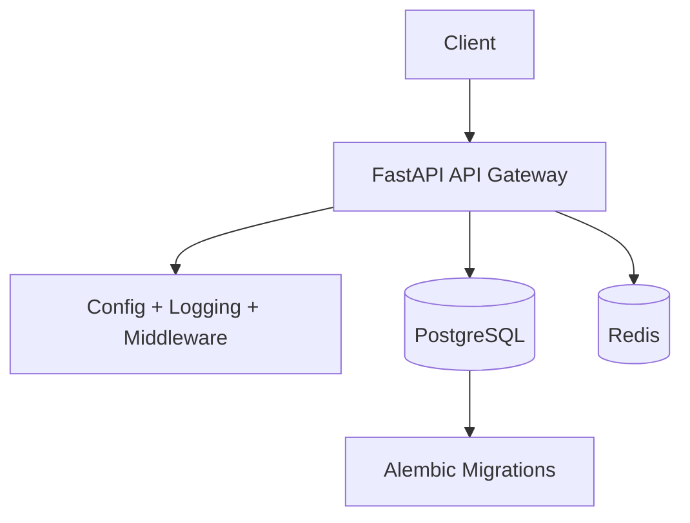

# Architecture Overview

AutoOps AI follows a layered architecture:

1. **API Layer (FastAPI)**: App factory, middleware, and versioned routers.
2. **Core Layer**: Configuration, logging, and exception handling.
3. **Data Layer**: SQLAlchemy models, async sessions, and Alembic migrations.
4. **Infra Layer**: Docker + Compose for local/prod-like deployments.

