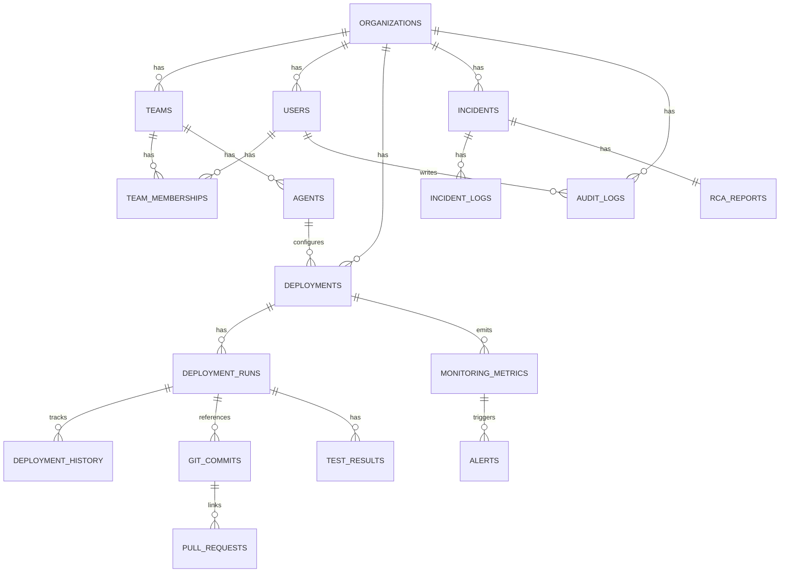

# ER Diagram

```mermaid
erDiagram
  ORGANIZATIONS ||--o{ TEAMS : has
  ORGANIZATIONS ||--o{ USERS : has
  TEAMS ||--o{ TEAM_MEMBERSHIPS : has
  USERS ||--o{ TEAM_MEMBERSHIPS : has
  TEAMS ||--o{ AGENTS : has
  ORGANIZATIONS ||--o{ DEPLOYMENTS : has
  AGENTS ||--o{ DEPLOYMENTS : configures
  DEPLOYMENTS ||--o{ DEPLOYMENT_RUNS : has
  DEPLOYMENT_RUNS ||--o{ DEPLOYMENT_HISTORY : tracks
  ORGANIZATIONS ||--o{ INCIDENTS : has
  INCIDENTS ||--o{ INCIDENT_LOGS : has
  INCIDENTS ||--|| RCA_REPORTS : has
  DEPLOYMENTS ||--o{ MONITORING_METRICS : emits
  MONITORING_METRICS ||--o{ ALERTS : triggers
  DEPLOYMENT_RUNS ||--o{ GIT_COMMITS : references
  GIT_COMMITS ||--o{ PULL_REQUESTS : links
  DEPLOYMENT_RUNS ||--o{ TEST_RESULTS : has
  ORGANIZATIONS ||--o{ AUDIT_LOGS : has
  USERS ||--o{ AUDIT_LOGS : writes
```
